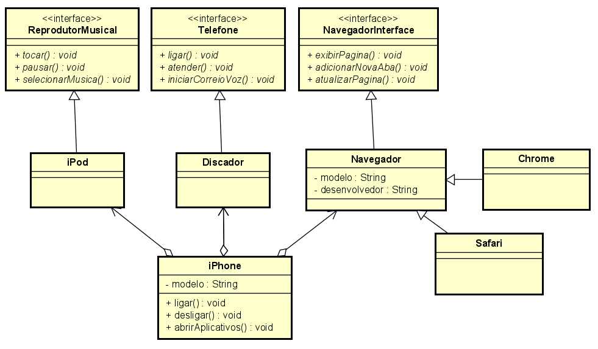

# Desafio iPhone
Desafio de diagramação UML e desenvolvimento código do mesmo de um modelo de funcionalidades do primeiro iPhone.

# Diagrama de classes
Diagrama de classes representando a resolução do desafio de POO/UML proposto pela [Digital Innovation One - DIO](https://github.com/digitalinnovationone/trilha-java-basico/tree/main/desafios/poo)

